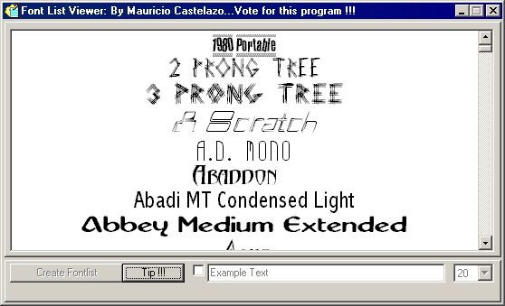



## A new era on Fonters\.\.\.Preview all your installed fonts\!\!\!

### Description

This code will make a formatted list of all your installed fonts, so you´ll be able to preview all of them in a hurry. Note that you won´t see font per font, you´ll see ALL of them in a single formatted list. Also, if you double click a font, its character set will appear in a new window. You must see how it works. You'll learn also, how to load controls on a fly with code.

Vote for this great code if you like it!!!
 
### More Info
 

             |
---                |---
**Submitted On**   |2001-01-16 23:31:44
**By**             |[Mauricio Castelazo Gamboa](https://github.com/Planet-Source-Code/PSCIndex/blob/master/ByAuthor/mauricio-castelazo-gamboa.md)
**Level**          |Beginner
**User Rating**    |4.9 (59 globes from 12 users)
**Compatibility**  |VB 4\.0 \(32\-bit\), VB 5\.0, VB 6\.0
**Category**       |[Miscellaneous](https://github.com/Planet-Source-Code/PSCIndex/blob/master/ByCategory/miscellaneous__1-1.md)
**World**          |[Visual Basic](https://github.com/Planet-Source-Code/PSCIndex/blob/master/ByWorld/visual-basic.md)
**Archive File**   |[CODE\_UPLOAD138531172001\.zip](https://github.com/Planet-Source-Code/mauricio-castelazo-gamboa-a-new-era-on-fonters-preview-all-your-installed-fonts__1-10617/archive/master.zip)

